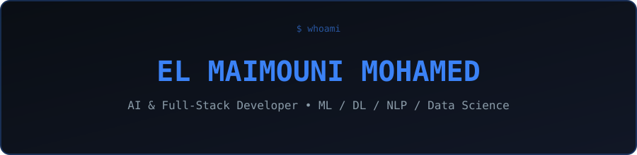

<div align="center">




<p>
  
  
  
</p>

<p>
  
  
  
</p>

<p>
  <a href="https://www.linkedin.com/in/mohamed-el-maimouni"></a>
  <a href="mailto:mohamedelmaimouni2023@gmail.com"></a>
  <a href="https://github.com/EL-MAIMOUNI-MOHAMED"></a>
</p>

</div>

---

### `$ cat about.md`

Artificial Intelligence student pursuing a **Licence d'Excellence en Intelligence Artificielle** at the Faculté des Sciences Ben M'Sick, Hassan II University of Casablanca (graduating June 2026). My background combines Machine Learning, Deep Learning, NLP, Data Science, IoT and Full-Stack Development — I like building intelligent applications that connect AI models with backend systems, databases and modern user interfaces.

```bash
ROLE     : AI & Full-Stack Developer
DOMAIN   : Machine Learning, Deep Learning, NLP, Data Science, IoT
STACK    : Python, PyTorch, React, Next.js, NestJS, Django, PostgreSQL
STATUS   : AI student @ FSBM Casablanca — graduating June 2026
OPEN_TO  : Internships, entry-level roles, research collaborations,
           impactful AI / Data Science / Full-Stack projects
CONTACT  : mohamedelmaimouni2023@gmail.com
```

---

### `$ ls tech-stack/`

<table>
<tr>
<td valign="top" width="50%">

**💻 Languages**
<p></p>

**⚛ Frontend**
<p></p>

**⚙ Backend**
<p></p>

</td>
<td valign="top" width="50%">

**🤖 AI / Machine Learning**
<p></p>
<p></p>

**🗄 Databases**
<p></p>

**☁ DevOps & Tools**
<p></p>

</td>
</tr>
</table>

---

### `$ cat specialties.md`

<p>
  
  
  
  
</p>

---

### `$ ./run expertise --table`

| Domain | Proficiency | Details |
|---|:---:|---|
| Machine Learning / Deep Learning | ⭐⭐⭐⭐☆ | PyTorch, scikit-learn, CNN, U-Net — from prediction models to signal detection |
| Natural Language Processing | ⭐⭐⭐☆☆ | Semantic analysis, OpenAI API integration for automated feedback |
| Full-Stack Development | ⭐⭐⭐⭐☆ | React, Next.js, NestJS, Django, PostgreSQL, REST APIs |
| IoT & Embedded Systems | ⭐⭐⭐☆☆ | RFID + IoT integration for real-time inventory tracking |
| Data Science | ⭐⭐⭐☆☆ | Python, predictive modeling (Random Forest), data-driven pipelines |

---

### `$ open featured-projects/`

<details open>
<summary><b>💊 PharmaSmart</b> — intelligent pharmaceutical inventory platform</summary>
<br>

| | |
|---|---|
| **Stack** | RFID, IoT, Django, React, PostgreSQL, Random Forest |
| **What it does** | Intelligent pharmaceutical inventory platform combining RFID and IoT tracking with a Random Forest model for stockout-risk prediction |
| **Role** | Full-stack + ML model development |

</details>

<details>
<summary><b>🌍 PhaseNet</b> — deep learning seismic phase detection</summary>
<br>

| | |
|---|---|
| **Stack** | U-Net, Deep Learning, Python |
| **What it does** | U-Net-based model for automatic seismic phase detection, trained on 10,000 real STEAD traces, achieving ~98.6% F1-score |
| **Role** | Model design & training |

</details>

<details>
<summary><b>📝 Evalya Smart</b> — AI-assisted educational assessment platform</summary>
<br>

| | |
|---|---|
| **Stack** | OpenAI API, Google Cloud Vision OCR, Node.js, React, React Native, PostgreSQL, AWS S3 |
| **What it does** | AI-assisted web and mobile assessment platform with semantic analysis, automated feedback, and OCR for scanned submissions |
| **Role** | Contributed REST APIs, user dashboards, document storage and mobile features (built during internship at IAAI) |

</details>

<details>
<summary><b>🏡 IMDAA</b> — real estate platform (web + mobile)</summary>
<br>

| | |
|---|---|
| **Stack** | Next.js, Node.js, PostgreSQL, React Native |
| **What it does** | Web and mobile real-estate platform |
| **Role** | Full-stack development |

</details>

---

### `$ cat languages.txt`

| Language | Level |
|---|---|
| Arabic | Native / Bilingual |
| French | Professional Working |
| English | Professional Working |
| Spanish | Conversational |

---

### `$ ./github-stats --analyze`

<p align="center">
  
  
</p>

<p align="center">
  
</p>

<p align="center">
  
</p>

<p align="center">
  
</p>
<p align="center">
  
  
</p>
<p align="center">
  
  
</p>

<p align="center">
  
</p>

---

### `$ cat currently.yaml`

```yaml
studying:
  - Licence d'Excellence en Intelligence Artificielle @ FSBM (grad June 2026)
building:
  - PharmaSmart: RFID + IoT + Django + React + PostgreSQL + Random Forest
  - PhaseNet: U-Net deep learning model for seismic phase detection
exploring:
  - Natural Language Processing
  - Computer Vision
  - Data Science
  - IoT
open_to:
  - Internships
  - Entry-level opportunities
  - Research collaborations
  - AI / Data Science / Full-Stack projects
```

---

### `$ ./connect --all`

<p align="center">
  <a href="https://github.com/EL-MAIMOUNI-MOHAMED"></a>
  <a href="https://www.linkedin.com/in/mohamed-el-maimouni"></a>
  <a href="mailto:mohamedelmaimouni2023@gmail.com"></a>
</p>

<p align="center"><i>"Building intelligent applications that connect AI models with backend systems, databases and modern user interfaces."</i></p>

<p align="center"></p>
